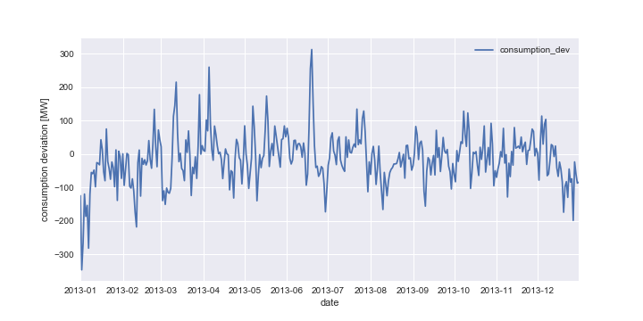
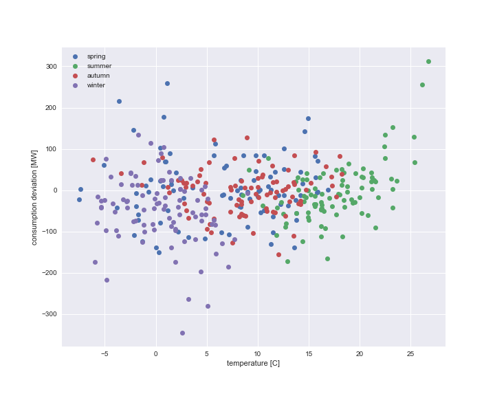
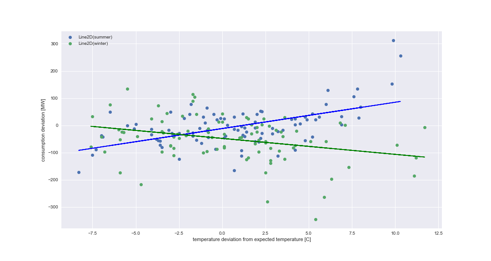

## Consumption deviation from forecasted temperature

*Complete evaluation can been found* [here](https://github.com/jimixxperez/consumption_dev/blob/master/consumption_deviation.ipynb)

positive value = deficit = more consumption than expected

negative value = surplus = less consumption than expected

The assumption is that the average value on one day is positive (deficit) or negative (surplus) depending on the temperature deviation in Germany on that day.

Why? Energy supplier are doing their daily consumption forecast based on the historical temperature for the same day.  Example: If they do a forecast for the consumption for the 01.01.13, they will look on the temperature of the 01.01 of 2012, 01.01 of 2011, 01.01 of 2010… etc.

That is why we expect for example a deficit in a cold winter (because of more heating) and a surplus in a warm winter.
We expect the reverse relationship in summer.
Can we say with a certain probability that we will have a surplus or a deficit depending on the temperature deviation?
For this, please compare the daily temperature for 2013 with the average temperature of these days in the past (you can choose the amount of years you take to calculate the average)

## Results

*consumption deviation in the year 2013*

Winter and summer show a high variations of consumption deviations in comparison to spring and autumn.

*consumption deviation in the year 2012 with confidence interval determined from the past 5 years*

in the two extreme seasons, winter and summer, the surplus or deficit of power consumptions can be partially related to temperature deviation from forecasted / expected temperatures. This behavior can roughly captured by linear regression [see figure below]. As expected summer exhibits the inverse behavior of the winter (direct vs inversely proportional).

**consumption deviation vs temperature deviation from forecasted temperature**

