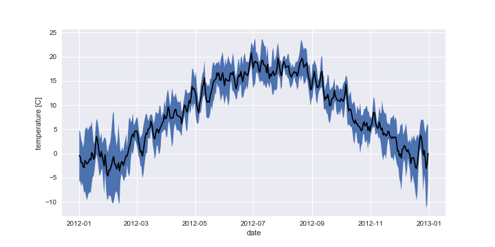
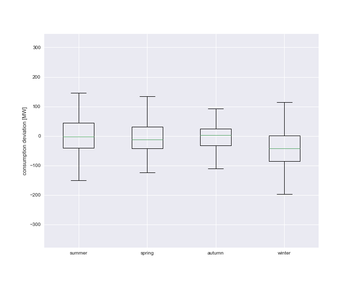

# Consumption deviation from forecasted temperature in Germany
## Background

**Complete evaluation can been found** [here](https://github.com/jimixxperez/consumption_dev/blob/master/consumption_deviation.ipynb)

__positive value__ = deficit = more consumption than expected

__negative value__ = surplus = less consumption than expected

The assumption is that the average value on one day is positive (deficit) or negative (surplus) depending on the temperature deviation in Germany on that day.

Why? Energy supplier are doing their daily consumption forecast based on the historical temperature for the same day.  Example: If they do a forecast for the consumption for the 01.01.13, they will look on the temperature of the 01.01 of 2012, 01.01 of 2011, 01.01 of 2010… etc.

That is why we expect for example a deficit in a cold winter (because of more heating) and a surplus in a warm winter.
We expect the reverse relationship in summer.
Can we say with a certain probability that we will have a surplus or a deficit depending on the temperature deviation?
For this, please compare the daily temperature for 2013 with the average temperature of these days in the past (you can choose the amount of years you take to calculate the average)

## Results

As we can clearly see in the figure below the consumption deviation exhibits high fluctuations (with high outsiders) over the course of the year 2013. Especially in the winter month we can see that the fluctuation distribution is not zero centered but has a negative tendency (less consumption than expected). This could probably mean that the winter was warmer than forecasted.

Consumption deviation in the year 2013.

In the temperature progression distribution (see figure below) we can see that the curve exhibits higher variations in winter. This indicates that temperature forecast in winter based on the past years are harder to make.

Temperature progression in the year 2012 with confidence interval based on the past 5 years.

---
Furthermore we can clearly see in the figure below that the consumption deviation fluctuations are the strongest in winter, spring and summer (with fewer outsiders). We can again see that the summer and winter distributions are not zero centered, i.e. we have a deficit in winter (negative expectation value) and surplus in summer (positive expectation value) for the year 2013.

consumption deviation in the year 2013 vs temperature deviation based on forecasted temperature

 

Boxplot of consumption deviation in the year 2013.

---
in the two extreme seasons, winter and summer, the surplus or deficit of power consumptions can be partially related to temperature deviation from forecasted / expected temperatures. This behavior can be roughly captured by linear regression (see figure below). As expected summer exhibits the inverse behavior of the winter (direct vs inversely proportional).

consumption deviation vs. temperature deviation based on forecasted temperature from the past 5 years.

 __slope__ = consumption deviation per degree of temperature deviation

 It is hard to make any kind of prognosis about the consumption deviation with respect to the temperature deviation since the error is very large. However there is a tendency that can be captured by the regression.

| season | slope [MW / C] | interception [MW]|
| ------ | ----- | ------------ |
| summer | 9.67 +- 60 | -- |
| winter | -5.86 +- 102 | -- |

 Slope errors correspond to 1 sigma (68%).

